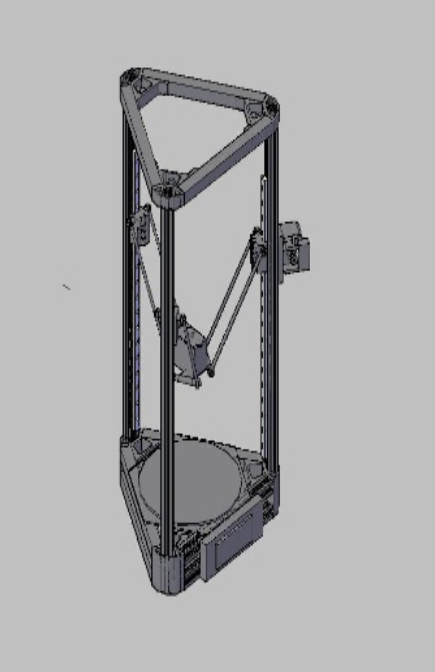

# Ex. No. 5 - SIMULATION-OF-DELTA-3D-PRINTER-MACHINE

### DATE: 
## AIM:
 To simulate the construction of delta 3D printer and to get in-depth knowledge of mechatronics of delta 3D printer.

## REQUIREMENTS:
● System - Windows 7 or higher, 1 GB RAM.

## PROCEDURE:

## Assembly of Delta 3D Printer
 1.	Select 'Assembly of Delta 3D Printer' from the visible list.
 2.	All the parts related to Delta 3D Printer will be shown on the screen.
 3.	Select the parts in sequence in which they are shown.
 4.	When the first part is selected then it will open in the blank space in the left side of the screen.
 5.	Further, when the correct part will be selected then it will get assembled with the previously selected part/parts.
 6.	If the user follows an incorrect sequence then a pop-up will appear on the screen showing the name of the part to be selected.

## Playing with Axes
 1.	Move the z1-axis slider or enter the value (within the given range) in the given text box and press/select ENTER. Now observe the movement of the z1-axis assembly.
 2.	Move the z2-axis slider or enter the value (within the given range) in the given text box and press/select ENTER. Now observe the movement of the z2-axis assembly.
 3.	Move the z3-axis slider or enter the value (within the given range) in the given text box and press/select ENTER. Now observe the movement of the z3-axis assembly.

## OUTPUT:

## Base:

The base refers to the bottommost part of the delta 3D printer assembly. It serves as the foundation and provides stability to the printer. The base is typically a solid structure that supports other components and ensures the printer's overall structural integrity.

## Holder:

A holder is a component used to secure and hold various parts in place within the printer assembly. It can be a bracket, clamp, or similar device designed to maintain the position and stability of specific components.

## Rod:

In the context of a delta 3D printer assembly, a rod refers to a long and slender cylindrical structure. Rods are often made of metal or other rigid materials and play a crucial role in the printer's construction and movement system. They are typically used as arms or supports in the delta mechanism to control the positioning of the print head.

## Top cover:

The top cover is a protective covering or enclosure that is placed over the top part of the delta 3D printer assembly. It helps shield the internal components from dust, debris, and accidental contact. The top cover can be removable or integrated into the frame design.

## Top cover frame:

The top cover frame refers to the structural framework that supports and holds the top cover in place. It provides stability and rigidity to the top cover and ensures proper alignment with the rest of the printer assembly.

## Linear rail:

A linear rail is a guiding mechanism used to provide smooth and precise linear motion in a delta 3D printer. It consists of a rail and a carriage that moves along the rail. The linear rail system enables the smooth movement of the print head or other components along a specific axis.

## Motor:

Motors in a delta 3D printer assembly are electrical devices that convert electrical energy into mechanical motion. They are typically stepper motors used to control the movement of the print head or other components in the printer. Motors play a critical role in achieving accurate positioning and controlled movement during the printing process.

## Bed:

The bed, also known as the print bed or build plate, is the surface on which the object being printed is created. It can be a flat or heated platform that provides a stable and level surface for the print job. The bed moves or remains stationary while the print head deposits layers of material to build the object.

## Slide with connector:

The slide with connector refers to a component in the delta 3D printer assembly that allows smooth and controlled sliding motion. It is often used in the arms or carriages of the delta mechanism to facilitate the movement of the print head.

## Connecting Rods:

Connecting rods are rigid bars that connect different components in the delta 3D printer assembly. They are used to link the various moving parts and ensure coordinated and synchronized movement.

## Extruder:

The extruder in a delta 3D printer assembly is responsible for feeding and controlling the flow of filament material during the printing process. It typically consists of a motor, filament drive mechanism, and a hot end or nozzle. The extruder melts the filament and deposits it layer by layer to create the 3D printed object.

## Pins:

Pins are small cylindrical metal or plastic components used to secure or connect different parts of the printer assembly. They may act as axles, pivot points, or locking mechanisms in various joints and connections.

## Motor with gear:

A motor with gear refers to a stepper motor coupled with a gear mechanism. This combination allows for increased torque or speed reduction, depending on the gear ratio. Motor with gears are commonly used in delta 3D printers to provide precise and controlled movement.

## LCD:

LCD stands for Liquid Crystal Display. In the context of a delta 3D printer assembly, an LCD is a display screen integrated into the printer's control interface. It provides visual feedback and allows the user to interact with the printer by displaying menu options, settings, print progress, and other relevant information.

### Name: Yogeshvar M
### Register Number: 212222230180

## Result: 
Thus the simulation on construction of delta 3D printer is completed & movement of axis along X, Y, & Z has been studied.
